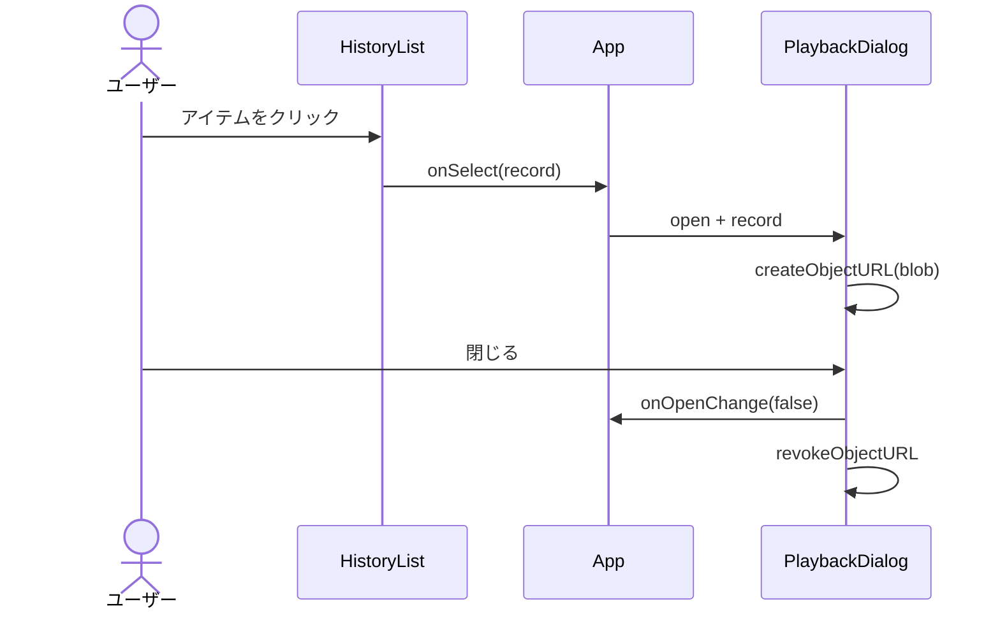

# AGENTS.md

このファイルは **Kiro CLI**(`kiro-cli chat`)がこのリポジトリで作業する際のガイドです。
他の AI コーディングエージェントが参照しても支障のない、ツール非依存の記述を心掛けています。

## プロジェクト概要

**golf-demo-app** は **Vibe Coding ワークショップ** のベースアプリです。
ゴルフ上達をテーマにした、ローカルだけで動作するシンプルな Web アプリで、参加者がここから Kiro CLI との対話で機能を拡張していく体験を提供します。

**入力ソースは PC のカメラ(Webcam)のみ**。動画ファイルのアップロード機能は持たない。
カメラ映像をリアルタイムに姿勢推定し、骨格をオーバーレイ描画 + 姿勢スコアを常時表示する。
スイングを「録画」ボタンで `MediaRecorder` で記録し、IndexedDB に履歴として保存する。

### 重要なゴール

このアプリ自体は完成形ではなく、**「Vibe Coding で機能追加していく出発点」** です。
そのため、設計方針として以下を優先します:

- **最小限のコードで動く** — 参加者がコード全体を把握しやすい
- **拡張ポイントが明確** — どこに何を足せばよいかが直感的にわかる
- **ローカル完結** — 外部 API・サーバーへの依存をゼロにし、ワークショップ環境(オフラインでも動く)を担保
- **派手な見た目より素朴さ** — 改造後との差を体感させる

## 技術スタック

- **ビルドツール**: Vite
- **フレームワーク**: React + TypeScript (strict)
- **スタイリング**: Tailwind CSS + **shadcn/ui** (CSS 変数ベース、ライトテーマのみ)
- **アイコン**: `lucide-react` (shadcn が標準採用)
- **姿勢推定**: `@mediapipe/tasks-vision` (Pose Landmarker / WebAssembly)
- **ストレージ**: IndexedDB (`idb` ラッパー)
- **品質**: ESLint + Prettier
- **サーバー/バックエンド**: なし(完全ローカル)

### 対応ブラウザ

- 主: **Chrome / Edge 最新版**(MediaPipe + getUserMedia + MediaRecorder すべて安定)
- 副: Safari 最新版(MediaRecorder の MIME 対応が限定的。`video/mp4` を優先指定)
- Firefox は best-effort

> **HTTPS 必須**: `getUserMedia` は `localhost` 以外では HTTPS でしか動作しない。
> ローカル開発は `http://localhost:5173` で問題なし。LAN 越しに別端末から触る場合は `vite --host` + 自己署名証明書が必要。

## ディレクトリ構成

実装前の **設計図** として詳細を記述します。実装時はこの構成に従ってください。
ファイル数を絞り、参加者が全体を把握できる規模に保つことを優先します。

```
golf-demo-app/
├── AGENTS.md             # このファイル(AI エージェント向けガイド)
├── README.md             # 参加者向けガイド(日本語)
├── .gitignore
├── .eslintrc.cjs         # ESLint 設定
├── .prettierrc           # Prettier 設定
├── components.json       # shadcn/ui CLI 設定
├── index.html            # Vite のエントリ HTML
├── package.json
├── tsconfig.json
├── tsconfig.node.json    # vite.config.ts 用の TS 設定
├── vite.config.ts
├── tailwind.config.js
├── postcss.config.js
├── public/
│   └── models/
│       └── pose_landmarker_lite.task   # MediaPipe モデル(同梱しない場合は CDN)
└── src/
    ├── main.tsx          # React エントリ。<App /> をマウント
    ├── App.tsx           # 画面全体のレイアウト + 状態の親
    ├── index.css         # Tailwind ディレクティブ + shadcn の CSS 変数
    ├── types.ts          # 共有型(SwingRecord, PoseFrame など)
    ├── components/
    │   ├── ui/                       # shadcn/ui がここに生成
    │   │   ├── button.tsx
    │   │   ├── card.tsx
    │   │   ├── alert.tsx
    │   │   ├── badge.tsx
    │   │   └── ...                   # 必要に応じて追加
    │   ├── CameraView.tsx            # カメラ映像 + 骨格オーバーレイ
    │   ├── PoseOverlay.tsx           # MediaPipe で骨格を Canvas 描画
    │   ├── JudgePanel.tsx            # リアルタイムスコア + 録画コントロール
    │   ├── HistoryList.tsx           # 録画済みクリップの一覧(保存のみ、再生機能なし)
    │   ├── EmptyState.tsx            # 履歴ゼロ件などの空状態
    │   └── ErrorBanner.tsx           # 共通エラー表示(shadcn Alert ラッパー)
    └── lib/
        ├── utils.ts      # cn() ヘルパー (shadcn 標準)
        ├── camera.ts     # getUserMedia ラッパー
        ├── recorder.ts   # MediaRecorder ラッパー
        ├── storage.ts    # IndexedDB ラッパー
        ├── pose.ts       # MediaPipe 初期化と推論
        └── judge.ts      # 判定ロジック(最初はダミー)
```

### 各ファイルの責務

#### ルート

| ファイル             | 役割                                                                                                                                            |
| -------------------- | ----------------------------------------------------------------------------------------------------------------------------------------------- |
| `index.html`         | `<div id="root">` と `<script src="/src/main.tsx">` のみ。タイトルは「Golf Demo App」                                                           |
| `package.json`       | 下記「依存関係」を参照                                                                                                                          |
| `vite.config.ts`     | React プラグイン + パスエイリアス `@` → `./src`                                                                                                 |
| `tailwind.config.js` | shadcn 標準の `content`, CSS 変数ベースの `theme.extend.colors`, `tailwindcss-animate` プラグイン                                               |
| `postcss.config.js`  | tailwindcss + autoprefixer                                                                                                                      |
| `tsconfig.json`      | `strict: true`, `jsx: "react-jsx"`, `target: "ES2022"`, `paths: { "@/*": ["./src/*"] }`                                                         |
| `components.json`    | shadcn の `style: "default"`, `tailwind.cssVariables: true`, `aliases.components: "@/components"`, `aliases.utils: "@/lib/utils"`               |
| `.eslintrc.cjs`      | Vite の React+TS テンプレート同梱の設定をそのまま採用(`eslint:recommended`, `@typescript-eslint/recommended`, `plugin:react-hooks/recommended`) |
| `.prettierrc`        | `{ "semi": false, "singleQuote": true, "trailingComma": "all", "printWidth": 100 }`                                                             |

#### `src/types.ts`

アプリ全体で使う型を集約。`any` は禁止。

```ts
export type Judgement = {
  score: number // 1-5
  comment: string // "ナイススイング!" など
}

export type SwingRecord = {
  id: string // crypto.randomUUID()
  createdAt: number // Date.now()
  durationMs: number // 録画時間
  videoBlob: Blob // 録画クリップ (video/webm or video/mp4)
  mimeType: string // "video/webm;codecs=vp9" など
  judgement: Judgement // 録画停止時点のスコア
}

export type PoseFrame = {
  // MediaPipe NormalizedLandmark[] と同形(0-1 正規化座標)
  landmarks: { x: number; y: number; z: number; visibility: number }[]
}

export type CameraStatus =
  | { kind: 'idle' }
  | { kind: 'requesting' } // getUserMedia 中
  | { kind: 'ready'; stream: MediaStream }
  | { kind: 'denied' } // ユーザーが拒否
  | { kind: 'error'; message: string }

export type RecordingStatus =
  | { kind: 'idle' }
  | { kind: 'recording'; startedAt: number }
  | { kind: 'finalizing' } // Blob 化中
```

#### `src/lib/camera.ts`

`getUserMedia` の薄いラッパー。

```ts
export async function startCamera(): Promise<MediaStream>
export function stopCamera(stream: MediaStream): void
```

- 解像度希望: `{ video: { width: { ideal: 1280 }, height: { ideal: 720 }, facingMode: 'user' }, audio: false }`
- 音声は **取らない**(プライバシー配慮 + 容量削減)
- `stopCamera` は全 track を `stop()` してハードウェアを解放

#### `src/lib/recorder.ts`

`MediaRecorder` の薄いラッパー。

```ts
export type Recorder = {
  start(): void
  stop(): Promise<{ blob: Blob; mimeType: string; durationMs: number }>
}
export function createRecorder(stream: MediaStream): Recorder
```

- MIME 優先順位: `video/webm;codecs=vp9` → `video/webm;codecs=vp8` → `video/mp4` → ブラウザデフォルト
- `MediaRecorder.isTypeSupported` で先頭から見つかったものを採用
- `dataavailable` の chunk を蓄積し、`stop` で `Blob` 化
- 録画中の chunk タイムスライスは 1000ms

#### `src/lib/storage.ts`

IndexedDB の薄いラッパー。`idb` を使う。

```ts
export async function saveSwing(record: SwingRecord): Promise<void>
export async function listSwings(): Promise<SwingRecord[]> // 新しい順
export async function deleteSwing(id: string): Promise<void>
```

- DB 名: `golf-demo`、オブジェクトストア: `swings`、keyPath: `id`
- インデックス: `createdAt` で降順取得

#### `src/lib/pose.ts`

MediaPipe Pose Landmarker のシングルトン的初期化と、フレーム推論を提供。

```ts
export async function initPose(): Promise<void> // アプリ起動時に1回
export function detect(video: HTMLVideoElement, timeMs: number): PoseFrame | null
export function drawPose(
  ctx: CanvasRenderingContext2D,
  frame: PoseFrame,
  w: number,
  h: number,
): void
```

- `runningMode: "VIDEO"` で初期化(ライブカメラもこのモードで OK)
- モデル URL は `/models/pose_landmarker_lite.task`(public 配下)を優先、なければ CDN フォールバック
- `drawPose` は 33 点を緑の円 + 主要関節の線で描画(コードを短く保つため接続定義は最小限に)
- カメラ映像は **左右反転表示**(自撮り感)するため、Canvas 側で `ctx.scale(-1, 1)` するか、`<video>` を CSS `transform: scaleX(-1)` する。**両方を反転すると元に戻る** ので片方だけにする(本実装では `<video>` を CSS 反転、Canvas は反転しない座標系で扱う)
- React StrictMode の二重マウント対策として、`landmarker` と `initPromise` をモジュールスコープで保持し `initPose()` を冪等化する

#### `src/lib/judge.ts`

**ワークショップで本格化させる主要ターゲット**。最初はダミー実装。

```ts
export function judge(frame: PoseFrame | null): Judgement
```

- 入力は **直近のポーズ 1 フレーム**(リアルタイム判定)
- 初期実装: ポーズが取れていれば固定で「姿勢チェック中」、`visibility` 平均が高ければスコア +1 する程度の単純判定
- ファイル末尾に `// TODO(workshop): スイング軌跡や肩の回転角を使った本格判定に拡張する` を残す

#### `src/components/CameraView.tsx`

```ts
type Props = {
  stream: MediaStream
  videoRef: React.RefObject<HTMLVideoElement>
  isRecording: boolean
}
```

- `<video ref={videoRef} autoPlay playsInline muted>` をラップ
- `useEffect` で `videoRef.current.srcObject = stream` をセット(クリーンアップで `null`)
- `<video>` には CSS `transform: scaleX(-1)` で左右反転(自撮り感)
- 親要素を `relative` にして、子に `<PoseOverlay videoRef={videoRef} />` を絶対配置で重ねる
- 録画中は枠を赤くする視覚フィードバック(`isRecording && 'ring-4 ring-destructive'`)

#### `src/components/PoseOverlay.tsx`

```ts
type Props = {
  videoRef: React.RefObject<HTMLVideoElement>
  onFrame: (frame: PoseFrame | null) => void
}
```

- video と同じサイズの `<canvas>` を `position: absolute inset-0` で重ねる
- `requestAnimationFrame` ループで `pose.detect()` → `pose.drawPose()` → `onFrame` で親に通知
- ライブカメラなので **常時推論**(動画ファイル時のような pause 配慮は不要)
- アンマウント時は `cancelAnimationFrame`

#### `src/components/JudgePanel.tsx`

```ts
type Props = {
  judgement: Judgement // リアルタイムに常時更新される
  recording: RecordingStatus
  disabled: boolean
  onStartRecording: () => void
  onStopRecording: () => void
}
```

- 上段: スコア(★★★☆☆ 形式)+ コメント。`judgement` は親から毎フレーム的に渡される
- 下段: 録画ボタン
  - `idle` 時: 「● 録画開始」(赤丸アイコン)
  - `recording` 時: 「■ 停止 (経過 0:03)」と経過時間表示
  - `finalizing` 時: スピナー + 「保存中…」
- 録画停止 → 親が自動的に `saveSwing` を呼ぶ(別途「保存」ボタンは作らない、ワンタッチ完結)

#### `src/components/HistoryList.tsx`

```ts
type Props = {
  records: SwingRecord[]
  onDelete: (id: string) => void
}
```

- サムネイル無しのシンプルなリスト(日時 + 録画長 + 判定コメント + スコア)
- 各行に削除アイコン(`Trash2`)
- **クリップ再生機能は持たない**(ワークショップ拡張ネタとして意図的に残す)
- 空のとき `<EmptyState />` を表示
- 拡張ポイント: クリップ再生 UI の追加、サムネイル生成、フィルタ、グラフ

#### `src/App.tsx`

すべての状態を持つ親コンポーネント。

- 状態:
  - `cameraStatus: CameraStatus`
  - `recording: RecordingStatus`
  - `judgement: Judgement` (リアルタイムに毎フレーム更新)
  - `records: SwingRecord[]`
- 起動時 (順番):
  1. `initPose()` を await(モデル DL)
  2. `startCamera()` を await(ブラウザの許可ダイアログが出る)
  3. `listSwings()` で履歴ロード
- StrictMode の二重マウント対策に `cancelled` フラグ + 取得済み stream の解放を必ず行う
- 画面構成: 下記「画面設計」を参照(モーダルやルーティングなし、完全な 1 画面)

### データフロー

```
              [App] (mount)
                │
                ├── initPose()         (MediaPipe ロード)
                ├── startCamera()      (getUserMedia)
                └── listSwings()       (IndexedDB)
                │
                ▼
         ┌── stream ──→ [CameraView] ── videoRef ──→ [PoseOverlay]
         │                                              │
         │                                              │ onFrame(poseFrame)
         │                                              ▼
         │                                          judge(frame) → setJudgement
         │                                              │
         │                                              ▼
         └── stream ──→ [recorder.ts]              [JudgePanel] (常時表示)
                            │ start/stop                │
                            ▼                            │ onStartRecording / onStopRecording
                         { blob, mimeType, durationMs } │
                            │                            │
                            ▼                            ▼
                      saveSwing({...})  ←────────  judgement(stop時)
                            │
                            ▼
                       [HistoryList] (records 更新、保存・削除のみ)
```

### 依存関係(package.json)

```json
{
  "name": "golf-demo-app",
  "private": true,
  "version": "0.0.1",
  "type": "module",
  "scripts": {
    "dev": "vite",
    "build": "tsc -b && vite build",
    "preview": "vite preview",
    "typecheck": "tsc --noEmit",
    "lint": "eslint . --ext ts,tsx",
    "format": "prettier --write ."
  },
  "dependencies": {
    "@mediapipe/tasks-vision": "^0.10.x",
    "@radix-ui/react-scroll-area": "^1.x",
    "@radix-ui/react-separator": "^1.x",
    "@radix-ui/react-slot": "^1.x",
    "idb": "^8.x",
    "lucide-react": "^1.x",
    "react": "^18.x",
    "react-dom": "^18.x"
  },
  "devDependencies": {
    "@types/node": "^20.x",
    "@types/react": "^18.x",
    "@types/react-dom": "^18.x",
    "@typescript-eslint/eslint-plugin": "^8.x",
    "@typescript-eslint/parser": "^8.x",
    "@vitejs/plugin-react": "^4.x",
    "autoprefixer": "^10.x",
    "class-variance-authority": "^0.7.x",
    "clsx": "^2.x",
    "eslint": "^8.x",
    "eslint-config-prettier": "^10.x",
    "eslint-plugin-react-hooks": "^7.x",
    "postcss": "^8.x",
    "prettier": "^3.x",
    "tailwind-merge": "^3.x",
    "tailwindcss": "^3.x",
    "tailwindcss-animate": "^1.x",
    "typescript": "^5.x",
    "vite": "^5.x"
  }
}
```

> **shadcn/ui の各コンポーネント自体は `npx shadcn@latest add <name>` で `src/components/ui/` に直接コピーされる**。npm パッケージとしては入らないため、上記には含まれない。

新しいライブラリを足したくなったら、まず「上記で代替できないか?」を必ず検討。

## shadcn/ui のセットアップと使い方

### 初期セットアップ手順(実装フェーズで一度だけ)

```bash
# 1. プロジェクト初期化(Vite + React + TS)
npm create vite@latest . -- --template react-ts

# 2. Tailwind 導入
npm install -D tailwindcss postcss autoprefixer
npx tailwindcss init -p

# 3. パスエイリアス設定 (vite.config.ts と tsconfig.json)
#    → 下記「パスエイリアス」を参照

# 4. shadcn/ui 初期化
npx shadcn@latest init
#    プロンプト回答:
#      Style: Default
#      Base color: Slate
#      CSS variables: Yes

# 5. ベースアプリで使うコンポーネントを追加
npx shadcn@latest add button card alert badge separator scroll-area
```

### パスエイリアス

`vite.config.ts`:

```ts
import path from 'node:path'
import { defineConfig } from 'vite'
import react from '@vitejs/plugin-react'

export default defineConfig({
  plugins: [react()],
  resolve: {
    alias: { '@': path.resolve(__dirname, './src') },
  },
})
```

`tsconfig.json` の `compilerOptions`:

```json
{
  "baseUrl": ".",
  "paths": { "@/*": ["./src/*"] }
}
```

### ベースアプリで使う shadcn コンポーネント

| コンポーネント                              | 用途                                                 |
| ------------------------------------------- | ---------------------------------------------------- |
| `Button`                                    | 録画ボタン、削除ボタン                               |
| `Card` / `CardHeader` / `CardContent`       | カメラ領域、判定パネル、履歴アイテム                 |
| `Alert` / `AlertTitle` / `AlertDescription` | エラー表示・カメラ許可待ち・MediaPipe 初期化中の通知 |
| `Badge`                                     | スコア表示・録画中バッジ                             |
| `Separator`                                 | セクション区切り                                     |
| `ScrollArea`                                | 履歴リストのスクロール                               |

### コーディングパターン

**やる**:

- `import { Button } from '@/components/ui/button'` の形で使う
- `cn('base-class', condition && 'extra-class')` で条件付きクラス合成
- `lucide-react` のアイコンを `<Play className="h-4 w-4" />` のサイズで統一

**やらない**:

- `src/components/ui/` 配下のファイルを参加者向けの「拡張ポイント」と説明しない(shadcn の生成物なので原則触らない)
- shadcn が提供するコンポーネントを自作で再実装しない
- グローバル CSS を `index.css` 以外に書かない

## 画面設計

完全な **1 画面アプリ**(ルーティングなし、モーダルなし)。
レイアウトは **2 カラム構成**(デスクトップ専用、モバイル非対応)。

### 全体レイアウト

```
┌──────────────────────────────────────────────────────────────┐
│  🏌 Golf Demo App                                              │ ← ヘッダー (h-14)
├──────────────────────────────────────────────────────────────┤
│  [ErrorBanner があればここに固定表示]                            │
├────────────────────────────────────────────┬─────────────────┤
│                                            │                 │
│                                            │  📊 判定         │
│                                            │  ★★★☆☆ (3/5)   │
│        ┌──────────────────────────┐        │  「姿勢チェック中」│
│        │                          │        │                 │
│        │   カメラ映像 + 骨格        │        │  ┌────────────┐│
│        │   (左右反転表示)           │        │  │ ● 録画開始  ││
│        │                          │        │  └────────────┘│
│        │                          │        │  キー: R         │
│        │                          │        ├─────────────────┤
│        │                          │        │  📝 履歴         │
│        │                          │        │  ┌─────────────┐│
│        │                          │        │  │5/23 ★★★☆☆  ││
│        │                          │        │  │ 2.3秒    [🗑] ││
│        │                          │        │  ├─────────────┤│
│        │                          │        │  │5/22 ★★★★☆  ││
│        │                          │        │  │ 3.1秒    [🗑] ││
│        └──────────────────────────┘        │  └─────────────┘│
│        16:9 アスペクト比で最大化              │                 │
│                                            │                 │
└────────────────────────────────────────────┴─────────────────┘
       メイン領域 (flex-1, 最小 720px 想定)        サイドバー (w-80)
```

- 全体: `min-h-screen flex flex-col`
- メイン: 左 `flex-1` + 右 `w-80 shrink-0` の `flex flex-row`
- ヘッダーは固定高さ、ErrorBanner は条件表示
- 最小ブレイクポイント: 1024px(`lg:`)。それ未満では「デスクトップで開いてください」を表示

### 状態ごとの画面遷移

#### 状態 A: 初期化中(MediaPipe ロード + カメラ許可待ち)

- カメラエリア: グレー背景に `<Loader2 />` + 「カメラを起動しています…」
- サイドバー: スコアは「-」、録画ボタンは disabled、履歴は通常表示

#### 状態 B: カメラ拒否

- カメラエリア: 中央に大きく「📷❌ カメラへのアクセスが拒否されました」+ 「ブラウザ設定から許可後、再読込してください」
- 録画ボタン: disabled

#### 状態 C: 通常(カメラ ready、録画 idle)

- カメラエリア: ライブ映像 + 骨格オーバーレイ
- サイドバー上: リアルタイムスコア(常時更新)
- 録画ボタン: 「● 録画開始」

#### 状態 D: 録画中

- カメラエリア: ライブ映像 + 骨格 + 赤い枠 (`ring-4 ring-destructive`) + 左上に `Badge` で「● REC 0:03」
- サイドバー: スコアはリアルタイム継続、ボタンは「■ 停止 0:03」
- 30 秒で自動停止

#### 状態 E: 録画停止 → Blob 化中

- 録画ボタン: スピナー + 「保存中…」(disabled)
- 保存完了後、履歴の最上部に新しいアイテムが追加(highlight アニメーション 1 秒)

> **クリップ再生は実装しない**(履歴は保存と一覧表示のみ)。
> 再生機能はワークショップ参加者が依頼すれば追加する **拡張ネタ** として意図的に残す。

### サイドバーの内訳

```
┌─────────────────────┐
│ 📊 判定              │  ← Card (上半分)
│                     │
│   ★★★☆☆            │   shadcn Badge を 5 個並べる
│   3 / 5             │
│                     │
│   姿勢チェック中       │   コメント
│                     │
│   ─────────────     │   Separator
│                     │
│   [● 録画開始]       │   Button (variant=destructive 風)
│   キー: R            │   小さなテキスト
└─────────────────────┘
┌─────────────────────┐
│ 📝 履歴              │  ← Card (下半分、ScrollArea)
│                     │
│  ┌────────────────┐ │
│  │ 2026/05/23 14:32│ │   履歴アイテム (Card or div)
│  │ ★★★☆☆ (3/5)    │ │
│  │ 2.3秒「ナイス!」 │ │
│  │             [🗑] │ │
│  └────────────────┘ │
│  ┌────────────────┐ │
│  │ ...            │ │
│  └────────────────┘ │
│                     │
│ (ゼロ件時は EmptyState)
└─────────────────────┘
```

- サイドバーは縦に 2 つの Card
- 上: 判定 + 録画ボタン (固定高さ、`h-auto`)
- 下: 履歴 (残りスペース、`flex-1` + `overflow-y-auto`)

### Tailwind の主要レイアウトクラス

```tsx
// App.tsx の最外殻
<div className="min-h-screen flex flex-col bg-background text-foreground">
  <header className="h-14 border-b flex items-center px-6">...</header>
  {error && <ErrorBanner ... />}
  <main className="flex-1 flex flex-row gap-4 p-4 lg:p-6">
    <section className="flex-1 min-w-0">
      <CameraView ... />
    </section>
    <aside className="w-80 shrink-0 flex flex-col gap-4">
      <JudgePanel ... />
      <HistoryList ... />
    </aside>
  </main>
</div>
```

### ヘッダーの内容

- 左: アプリアイコン + 「Golf Demo App」
- 右: 何も置かない(将来的にカメラ切替や設定ボタンの拡張ポイント)

## ローディング・空状態・エラー表示の方針

参加者の Vibe Coding 成果物のクオリティを底上げするため、以下のパターンを最初から仕込んでおく。

### ローディング

- **MediaPipe 初期化中**: カメラエリアに shadcn `Alert` で「姿勢推定モデルを読み込み中…」を表示
- **カメラ起動待ち** (`requesting`): カメラエリアに「ブラウザのカメラ許可を確認してください」+ スピナー
- **録画停止 → Blob 化中** (`finalizing`): JudgePanel に「保存中…」+ スピナー
- スピナーは `lucide-react` の `<Loader2 className="animate-spin" />` を使う

### 空状態(EmptyState コンポーネント)

- **カメラ拒否時** (`denied`): 中央に大きく「カメラへのアクセスが拒否されました。ブラウザの設定から許可してください」+ 再試行ボタン
- **履歴ゼロ件時**: 「まだスイングが記録されていません」+ `Camera` アイコン + 「録画ボタンで最初のスイングを記録しましょう」

### エラー表示(ErrorBanner コンポーネント)

- shadcn `Alert` の `variant="destructive"` をラップ
- 表示元: カメラエラー (`error`)、MediaPipe 初期化失敗、MediaRecorder の MIME 非対応、IndexedDB エラー
- App レベルで `error: string | null` 状態を持ち、画面上部に固定表示
- 自動消去はしない(参加者がエラーに気づきやすいように)

## メモリ管理

リアルタイム映像 + 録画クリップを扱うため、リーク対策が重要。

### MediaStream のライフサイクル

- `App` 起動時に `startCamera()` で 1 つだけ取得し、アプリ終了まで保持
- ページアンロード時 (`beforeunload`) に全 track を `stop()`
- 開発中に StrictMode の二重マウントで stream が重複取得されないよう注意(`cancelled` フラグと取得済み stream の解放でガード)

### MediaRecorder のライフサイクル

- 録画開始時に新規生成、`stop` 後は破棄
- `dataavailable` のリスナーは `onstop` の中で外す

### URL.createObjectURL の管理

- ライブカメラには `URL.createObjectURL` を使わない(`srcObject` に MediaStream を直接代入)
- ベース実装ではクリップ再生がないため `URL.createObjectURL` の用途は基本ない
- ワークショップで再生機能を追加する場合は、コンポーネントの `useEffect` クリーンアップで必ず `revoke` する

### MediaPipe のライフサイクル

- `PoseLandmarker` インスタンスは `lib/pose.ts` 内のモジュールスコープに 1 つだけ持つ
- アプリ終了時に明示的な `close()` は不要(タブを閉じればブラウザが解放)
- `requestAnimationFrame` のループは `PoseOverlay` のアンマウント時に `cancelAnimationFrame` で確実に停止

### IndexedDB のサイズ

- 録画クリップ Blob は数十 MB になることがある。**1 件あたり 100MB を超える場合は警告を出す**(将来拡張)
- 録画時間は **最大 30 秒** でハードキャップ(暴走防止)。`recorder.ts` 内でタイマーを設定し自動停止
- 履歴は最新 20 件までを表示し、古いものは UI 上で折りたたむ(将来拡張、初期実装は全件表示で OK)

## キーボードショートカットと a11y 最低ライン

- **R**: 録画開始 / 停止 トグル
- **Esc**: 録画中なら停止(誤入力対策)

実装場所: `JudgePanel` で `useEffect` で `window` に `keydown` リスナーを登録。
入力中(textarea, input)はショートカットを無効化(`document.activeElement` を確認)。

### a11y チェックリスト

- 全てのボタンに `aria-label` または可視テキスト
- 録画中は `<div role="status" aria-live="polite">録画中 0:03</div>` でスクリーンリーダーにも通知
- フォーカスリングを消さない(shadcn のデフォルトを尊重)
- カラーコントラスト: shadcn のデフォルトトークンに従う(自前でグレー指定しない)

## ESLint / Prettier

- ESLint と Prettier の競合を避けるため `eslint-config-prettier` を最後に extends する
- 保存時整形は IDE 側に任せる(`.vscode/settings.json` は作らない、参加者の環境を尊重)
- `npm run lint` で CI なしで動くこと
- 参加者が依頼する Vibe Coding の成果物にも自動で適用されるよう、Kiro CLI は出力後に Prettier ルールに沿った整形をする(セミコロンなし、シングルクォート、末尾カンマ all、行幅 100)

## コマンド

```bash
# 初回セットアップ
npm install

# 開発サーバー起動
npm run dev

# 型チェック
npm run typecheck

# 本番ビルド
npm run build

# ビルド結果のプレビュー
npm run preview
```

## 設計上の重要な決定

### 1. 入力ソースは PC カメラのみ(ファイル選択は持たない)

- `getUserMedia({ video: true, audio: false })` で取得
- アプリ起動直後にカメラ許可ダイアログを出す
- ファイルアップロード機能は **ワークショップで参加者が依頼すれば追加** という拡張ネタとして残す

### 2. 録画クリップは IndexedDB に Blob で保存する

- LocalStorage は容量制限が厳しいため使わない
- `MediaRecorder` で得た Blob (video/webm or video/mp4) をそのまま保存
- 履歴クリップは(再生機能を追加する場合)`URL.createObjectURL` で再生

### 3. MediaPipe は CDN から WASM を読み込む

- `FilesetResolver.forVisionTasks("https://cdn.jsdelivr.net/npm/@mediapipe/tasks-vision@0.10.14/wasm")` で初期化
- モデルファイル(`pose_landmarker_lite.task`)は CDN URL を直接渡す(`public/models/` に置く構成も可)
- 完全オフラインが必要な場合はモデルも同梱する

### 4. 「判定」ロジックは最初はダミーで、リアルタイムに常時更新

- `lib/judge.ts` は **ポーズフレーム 1 つを受け取って即時判定** する純粋関数
- **参加者が Vibe Coding でここを本格化させる** のが主要な拡張シナリオ
- 例: 直近 N フレームをバッファして時系列特徴量を計算、肩の回転角・軸ブレ・ヘッドアップを検出

### 5. オーバーレイは Canvas で動画の上に重ねる

- `<video>` と `<canvas>` を同サイズで重ね、`requestAnimationFrame` で骨格を描画
- カメラ映像は CSS `transform: scaleX(-1)` で反転表示し、Canvas は反転しない座標系で描画
- 録画は `<video>` 要素を経由せず元の `MediaStream` を `MediaRecorder` に渡す(反転は表示のみ、保存される映像は反転なし)

### 6. 録画は最大 30 秒、最低 1 秒

- 暴走防止のため上限あり
- 1 秒未満で停止すると「短すぎます」と通知して保存しない

## ワークショップ拡張アイデア

参加者が Kiro CLI に依頼することを想定した拡張シナリオ。
Kiro CLI が提案する際はこのリストから選ぶか、参加者の興味に合わせて派生させること。
複数ステップに渡る大きな改修を頼まれた場合は、`/plan` で計画を立ててから着手することを検討する。

### 初級(15-30分)

- **履歴クリップの再生機能を追加**: 履歴アイテムをクリックして録画を再生(モーダル or インライン)
- **判定アルゴリズムを本格化**: 頭の Y 座標のブレ幅でヘッドアップを検出
- **クラブ選択を追加**: ドライバー / アイアン / パターを選んで履歴に保存
- **コメント欄**: 各スイングにメモを残せるようにする
- **判定スコアのバッジ表示**: 5段階評価をカラフルに
- **動画ファイル読み込みも可能に**: カメラに加えてファイルからの読み込みも対応

### 中級(30-60分)

- **スイング軌跡の描画**: 手首のランドマークの軌跡を線で残す(録画クリップに焼き込み)
- **キーフレーム自動抽出**: アドレス/トップ/インパクトを自動検出してサムネイル表示
- **スコア推移グラフ**: Recharts などで時系列グラフ
- **録画自動トリミング**: スイング部分だけ自動で切り出して保存
- **カメラ切替**: 複数カメラがある場合に選択 UI

### 上級(60分以上)

- **肩・腰の回転角を計算**: 3D ランドマークから関節角度を算出
- **音でフィードバック**: インパクトのタイミングで音を鳴らす
- **GIF エクスポート**: 録画クリップから GIF を生成してシェア可能に
- **2 つの履歴を並べて比較**: 自分の過去スイングと最新を左右に
- **AI コメント**: Bedrock などのモデル API キーを入れてスイング講評させる(ローカル完結を破る選択肢)

## 仕様駆動で進める(最重要)

**ユーザーから機能追加・変更の依頼が来ても、いきなり実装しない**。
このリポジトリはワークショップのベースであり、参加者の依頼は「ふわっとしたゴール」だけのことが多い。実装に入る前に **仕様を握る** ステップを必ず挟む。

ただし Kiro IDE の Spec mode(requirements → design → tasks の3フェーズ承認)は重厚すぎるので使わない。代わりに **承認1回で実装に入る軽量版** を使う。

### 配置とファイル

機能ごとに `.kiro/specs/<feature-slug>/` フォルダを作り、以下の3つを置く(Kiro IDE の Specs と互換):

- `requirements.md` — ユーザーストーリー + 受入条件(目安 5〜15 行)
- `design.md` — 影響ファイル・データフロー・注意点(目安 10〜25 行、必要なら Mermaid)
- `tasks.md` — 実装ステップのチェックリスト(目安 5〜10 タスク)

各ファイル **30 行以内** を目標に。書きすぎていたら要点だけに削る。
`feature-slug` は kebab-case の短い英語名(例: `history-playback`, `swing-trajectory`)。

### Mermaid を使う

flow / 状態遷移 / コンポーネント関係は **Mermaid で書く**(テキスト 10 行より図 5 行のほうが速い)。

| 図種                  | 用途                                       |
| --------------------- | ------------------------------------------ |
| `flowchart` / `graph` | 処理の流れ、画面遷移、判定フロー           |
| `sequenceDiagram`     | コンポーネント間・ユーザー操作のやり取り   |
| `stateDiagram-v2`     | UI のモード遷移、ステートマシン            |
| `erDiagram`           | IndexedDB のスキーマや型関係               |

抑制ルール:

- Mermaid を使うのは **テキストより図のほうが短い** 場合だけ
- 1 図あたり **ノード10個以内**。超えたら分割するかテキストに戻す
- requirements.md と tasks.md は基本テキスト中心(必要なら使ってよい)

### ワークフロー

1. 依頼を受けたら、`.kiro/specs/<slug>/` に **3ファイルを一気に書く**
2. 1メッセージで「3ファイル作りました。これで進めて良いですか?」と承認を求める
3. OK が出たら実装。実装中は `tasks.md` のチェックを更新
4. 完了後、`tasks.md` の末尾に「変更点・残課題」を 2〜3 行追記

### 例

依頼: 「履歴をクリックして再生できるようにして」
↓
`.kiro/specs/history-playback/` に以下を作る。

**requirements.md**:

```markdown
# 履歴クリップの再生

## ユーザーストーリー

- ユーザーは履歴アイテムをクリックすると、録画クリップを再生できる
- 再生中もカメラ映像とリアルタイム判定は継続する

## 受入条件

- 履歴アイテムをクリックするとモーダルで録画が再生される
- モーダルを閉じると再生が止まり、Blob URL が解放される
- カメラ映像は止まらない
- 再生中はキー `R`(録画開始/停止)を無効化(誤操作防止)
```

**design.md**:

````markdown
# 設計

## 影響ファイル

- `HistoryList.tsx` — アイテムを `<button>` 化、onClick で親に通知
- `App.tsx` — 再生対象 state を追加、Dialog 開閉を制御
- 新規 `PlaybackDialog.tsx` — shadcn `Dialog` で `<video>` 再生

## 操作シーケンス



## 注意点

- `revokeObjectURL` は `useEffect` クリーンアップで必ず実行
- 録画ショートカット `R` は Dialog open 中は無効化
````

**tasks.md**:

```markdown
# 実装タスク

- [ ] `HistoryList.tsx`: アイテムを `<button>` 化、`onSelect` prop を追加
- [ ] `App.tsx`: `selectedRecord` state と Dialog 制御を追加
- [ ] `PlaybackDialog.tsx` を新規作成(shadcn Dialog + `<video>` で再生)
- [ ] `JudgePanel.tsx`: Dialog open 中はキー `R` を無効化
- [ ] `npm run typecheck` で確認
- [ ] 動作確認: 録画 → 履歴クリック → 再生 → 閉じる
- [ ] 完了後、この `tasks.md` 末尾に「変更点・残課題」を追記
```

### 仕様駆動を **省略してよい** ケース

- typo 修正・コメント追加・1行のスタイル調整
- ユーザーが具体的なコード変更を明示している(「`X.tsx` の Y を Z に変えて」)
- 直前のメッセージで仕様が確定済みで、その続きの実装

### 大きな変更は `/plan` を併用

状態管理ライブラリ導入や複数機能にまたがる再設計など、仕様自体の議論が長引く改修では `/plan` でプランナーエージェントに切り替えて要件を整理してから、上記フローに入る。

### git 管理

`.kiro/specs/` は **コミット対象**(過去の意思決定を残す)。`.gitignore` に追加しない。

迷ったら確認する側に倒す。**実装してから「やっぱり違う」となるより、確認 1 往復が遥かに安い**。

## Kiro CLI への指示

このリポジトリで作業するときの指針(上記「仕様駆動で進める」に加えて):

1. **過剰な抽象化を避ける** — ワークショップ参加者が読めるコード量に保つ。3 ファイルで済むなら 3 ファイルにする
2. **コメントは「なぜ」だけ** — 自明な処理にコメントを足さない。MediaPipe の癖など驚きがある箇所だけ書く
3. **エラー処理は最小限** — 入力検証は動画ファイルかどうか程度。try/catch を闇雲に入れない
4. **依存追加は慎重に** — 新しいライブラリを足すときは「Tailwind / shadcn/ui / MediaPipe / idb で代替できないか?」を先に検討。新規依存はユーザー承認を取る
5. **shadcn を優先** — UI 要素は shadcn コンポーネントを使う。自作で `<button className="px-4 py-2 ...">` を書かない
6. **拡張ポイントを残す** — 「ここを本格化できますよ」というコメントを `lib/judge.ts` などに 1 行残してもよい
7. **インクルーシブな用語を使う** — `master/slave` `whitelist/blacklist` などは使わず `primary/replica` `allowlist/denylist` を使う
8. **Prettier ルールを守る** — セミコロンなし、シングルクォート、末尾カンマ all、行幅 100。出力前に整形する
9. **検証して終わる** — ファイルを書き換えたら `npm run typecheck` などで影響範囲を確認してから完了報告する

## 状態管理について

- すべて `useState` + `useEffect` + props バケツリレーで足りる
- Context, Zustand, Redux, Jotai 等は **入れない**(参加者が「ここを Zustand 化したい」と依頼したら入れる)
- 状態は基本的に `App.tsx` に集約し、子コンポーネントは props で受け取る

## パフォーマンス目標

- カメラ映像は **30fps を目標**(`getUserMedia` のデフォルトに従う)
- MediaPipe の推論はフレームレートに追随する(間に合わなければ自動的に間引き)
- `judge` の実行は推論結果が出るたびなので 30Hz。重い処理を入れたい場合はワークショップで `requestIdleCallback` 化を提案
- 録画中も推論は止めない(録画と推論は独立した経路)

## 参考リンク

- MediaPipe Pose Landmarker: https://ai.google.dev/edge/mediapipe/solutions/vision/pose_landmarker/web_js
- Vite ドキュメント: https://vitejs.dev/
- idb (IndexedDB ラッパー): https://github.com/jakearchibald/idb
- shadcn/ui: https://ui.shadcn.com/
- Tailwind CSS: https://tailwindcss.com/
- lucide-react (アイコン): https://lucide.dev/
